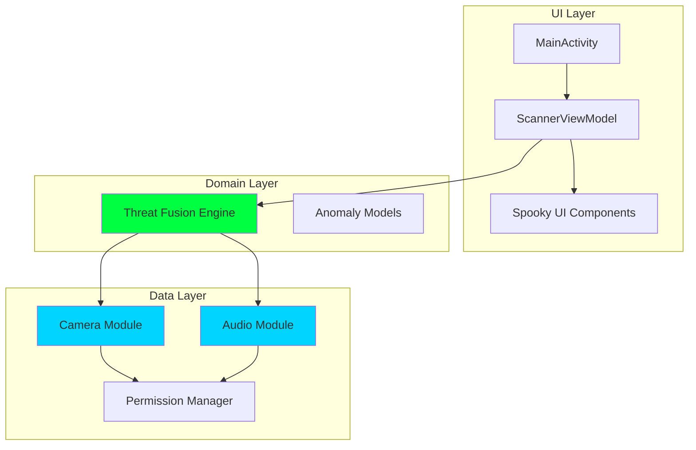

# Design Document

## Overview

Shadow Signal is a single-activity Android application built with Kotlin that creates a "paranormal scanner" experience through real-time sensor analysis. The app uses a modular architecture with three core processing modules (Camera, Audio, Threat Fusion) feeding data to a reactive UI layer. All processing happens on-device using lightweight algorithms optimized for mobile performance.

The design prioritizes:
- **Simplicity**: Minimal dependencies, straightforward algorithms
- **Performance**: 15+ FPS camera processing, <300ms audio latency
- **Modularity**: Independent, testable components with clear interfaces
- **CLI Buildability**: Pure Gradle setup without Android Studio dependencies

## Architecture

### High-Level Architecture



### Architecture Pattern

**MVVM (Model-View-ViewModel)** with reactive data flow:
- **View**: MainActivity + Jetpack Compose UI components
- **ViewModel**: ScannerViewModel manages state and coordinates modules
- **Model**: Camera/Audio modules + Threat Fusion Engine

This pattern provides:
- Clear separation of concerns
- Lifecycle-aware components
- Testable business logic
- Reactive UI updates via StateFlow/LiveData

### Technology Stack

| Component | Technology | Rationale |
|-----------|-----------|-----------|
| Language | Kotlin | Modern, concise, Android-first |
| UI Framework | Jetpack Compose | Declarative UI, easy animations |
| Camera | CameraX | Simplified camera API, lifecycle-aware |
| Audio | AudioRecord | Low-level access for FFT analysis |
| Build System | Gradle 8.x | CLI-friendly, standard Android builds |
| Min SDK | API 24 (Android 7.0) | Balances features and device coverage |
| Target SDK | API 34 (Android 14) | Latest stable |

**Optional Libraries** (if needed):
- OpenCV Android SDK (lightweight operations only)
- Apache Commons Math (FFT implementation)

## Components and Interfaces

### 1. Camera Module

**Responsibility**: Capture video frames and detect visual anomalies

**Interface**:
```kotlin
interface CameraAnalyzer {
    fun startAnalysis(lifecycleOwner: LifecycleOwner)
    fun stopAnalysis()
    fun getAnomalyFlow(): StateFlow<VisualAnomaly>
}

data class VisualAnomaly(
    val type: AnomalyType, // MOTION, LIGHT_CHANGE, CONTOUR
    val intensity: Float,   // 0.0 to 1.0
    val timestamp: Long,
    val affectedRegion: Rect? = null
)
```

**Implementation Details**:

1. **CameraX Setup**:
   - Use `Preview` + `ImageAnalysis` use cases
   - Configure for 640x480 resolution (balance quality/performance)
   - Target 30 FPS frame rate
   - YUV_420_888 format for efficient processing

2. **Image Diff Detection**:
   - Convert frames to grayscale
   - Calculate pixel-wise difference with previous frame
   - Count changed pixels (threshold: 15% of total)
   - Use simple absolute difference: `|current - previous| > threshold`

3. **Brightness Detection**:
   - Calculate mean luminance per frame
   - Compare with previous frame mean
   - Flag if change > 30%

4. **Contour Detection** (optional, if using OpenCV):
   - Apply Canny edge detection
   - Find contours with `findContours()`
   - Compare contour count/area with previous frame
   - Flag significant changes (>20% difference)

**Performance Optimization**:
- Process every 2nd or 3rd frame if needed
- Use downsampled images (320x240) for diff calculations
- Reuse bitmap buffers to reduce GC pressure

### 2. Audio Module

**Responsibility**: Capture audio and detect spectral anomalies

**Interface**:
```kotlin
interface AudioAnalyzer {
    fun startRecording()
    fun stopRecording()
    fun getAnomalyFlow(): StateFlow<AudioAnomaly>
    fun getSpectrumFlow(): StateFlow<FloatArray>
}

data class AudioAnomaly(
    val type: AnomalyType, // FREQUENCY, SPIKE
    val intensity: Float,   // 0.0 to 1.0
    val timestamp: Long,
    val frequency: Float? = null,
    val amplitude: Float? = null
)
```

**Implementation Details**:

1. **AudioRecord Setup**:
   - Sample rate: 44100 Hz
   - Channel: MONO
   - Encoding: PCM_16BIT
   - Buffer size: `AudioRecord.getMinBufferSize()` * 2

2. **FFT Analysis**:
   - Use 2048-sample windows (46ms at 44.1kHz)
   - Apply Hamming window to reduce spectral leakage
   - Perform FFT using Apache Commons Math or custom implementation
   - Calculate magnitude spectrum: `sqrt(re^2 + im^2)`

3. **Frequency Anomaly Detection**:
   - Analyze bins corresponding to <100Hz and >8000Hz
   - Convert magnitude to dB: `20 * log10(magnitude)`
   - Flag if any bin exceeds -40dB threshold

4. **Spike Detection**:
   - Calculate RMS amplitude per window
   - Track rolling average over last 10 windows
   - Flag if current > average + 20dB

5. **Real-time Processing**:
   - Run audio capture on background thread
   - Process FFT on coroutine (Dispatchers.Default)
   - Emit results via StateFlow

**Performance Optimization**:
- Use circular buffer for audio samples
- Limit FFT to necessary frequency range
- Downsample if 44.1kHz proves too intensive

### 3. Threat Fusion Engine

**Responsibility**: Combine sensor signals into unified threat assessment

**Interface**:
```kotlin
interface ThreatFusion {
    fun updateVisualAnomaly(anomaly: VisualAnomaly)
    fun updateAudioAnomaly(anomaly: AudioAnomaly)
    fun getThreatLevelFlow(): StateFlow<ThreatLevel>
    fun getCompositeScoreFlow(): StateFlow<Float>
}

enum class ThreatLevel {
    LOW,    // Score < 30
    MEDIUM, // Score 30-70
    HIGH    // Score > 70
}
```

**Implementation Details**:

1. **Scoring Algorithm**:
```kotlin
compositeScore = (visualScore * 0.6f) + (audioScore * 0.4f)

visualScore = max(
    motionIntensity * 100,
    lightChangeIntensity * 100,
    contourIntensity * 100
)

audioScore = max(
    frequencyAnomalyIntensity * 100,
    spikeIntensity * 100
)
```

2. **Temporal Smoothing**:
   - Apply exponential moving average to reduce jitter
   - `smoothedScore = alpha * newScore + (1 - alpha) * oldScore`
   - Alpha = 0.3 for responsive but stable readings

3. **Threat Level Mapping**:
   - LOW: 0-29
   - MEDIUM: 30-70
   - HIGH: 71-100

4. **Update Rate**:
   - Recalculate on every new anomaly event
   - Emit updates via StateFlow (UI observes)
   - Target <200ms from sensor input to UI update

### 4. Permission Manager

**Responsibility**: Handle runtime permissions for camera and microphone

**Interface**:
```kotlin
interface PermissionManager {
    fun checkCameraPermission(): Boolean
    fun checkMicrophonePermission(): Boolean
    fun requestPermissions(activity: Activity)
    fun getPermissionStateFlow(): StateFlow<PermissionState>
}

data class PermissionState(
    val cameraGranted: Boolean,
    val microphoneGranted: Boolean
)
```

**Implementation Details**:
- Use ActivityResultContracts for permission requests
- Request both permissions together on first launch
- Show rationale dialog if previously denied
- Gracefully degrade: camera-only or audio-only mode if one denied

### 5. UI Components

**Responsibility**: Display sensor data and threat levels in spooky theme

**Component Structure**:

```
MainActivity
├── ScannerScreen (Composable)
│   ├── CameraPreview
│   ├── ThreatMeter
│   ├── WaveformVisualizer
│   ├── SpectrumVisualizer
│   └── AnomalyOverlay
```

**Key Composables**:

1. **CameraPreview**:
   - Display CameraX preview
   - Overlay anomaly indicators (glowing rectangles)
   - Full-screen background

2. **ThreatMeter**:
   - Circular or arc gauge showing threat level
   - Color-coded: Green (LOW), Yellow (MEDIUM), Red (HIGH)
   - Animated transitions using `animateFloatAsState`
   - Neon glow effect using shadow/blur

3. **WaveformVisualizer**:
   - Real-time audio waveform
   - Draw using Canvas API
   - Neon green line on dark background
   - Update at 30 FPS

4. **SpectrumVisualizer**:
   - Frequency spectrum bars
   - Logarithmic frequency scale
   - Cyan bars with glow effect
   - Highlight anomaly frequencies in red

5. **AnomalyOverlay**:
   - Floating indicators for detected anomalies
   - Fade in/out animations
   - Show anomaly type and intensity
   - Position based on camera region (if available)

**Theme Configuration**:
```kotlin
val DarkBackground = Color(0xFF0A0A0A)
val NeonGreen = Color(0xFF00FF41)
val NeonCyan = Color(0xFF00D4FF)
val NeonRed = Color(0xFFFF0040)
val GlowAlpha = 0.6f
```

## Data Models

### Core Data Classes

```kotlin
// Anomaly base
sealed class Anomaly {
    abstract val intensity: Float
    abstract val timestamp: Long
}

data class VisualAnomaly(
    override val intensity: Float,
    override val timestamp: Long,
    val type: VisualAnomalyType,
    val affectedRegion: Rect? = null
) : Anomaly()

enum class VisualAnomalyType {
    MOTION,
    LIGHT_CHANGE,
    CONTOUR
}

data class AudioAnomaly(
    override val intensity: Float,
    override val timestamp: Long,
    val type: AudioAnomalyType,
    val frequency: Float? = null,
    val amplitude: Float? = null
) : Anomaly()

enum class AudioAnomalyType {
    FREQUENCY,
    SPIKE
}

// Threat assessment
data class ThreatAssessment(
    val level: ThreatLevel,
    val compositeScore: Float,
    val visualScore: Float,
    val audioScore: Float,
    val timestamp: Long
)

enum class ThreatLevel {
    LOW, MEDIUM, HIGH
}

// UI state
data class ScannerUiState(
    val threatAssessment: ThreatAssessment,
    val recentAnomalies: List<Anomaly>,
    val audioSpectrum: FloatArray,
    val permissionsGranted: Boolean,
    val isScanning: Boolean
)
```

### State Management

**ViewModel State**:
```kotlin
class ScannerViewModel : ViewModel() {
    private val _uiState = MutableStateFlow(ScannerUiState.default())
    val uiState: StateFlow<ScannerUiState> = _uiState.asStateFlow()
    
    // Collect from modules and update UI state
    init {
        viewModelScope.launch {
            combine(
                threatFusion.getThreatLevelFlow(),
                audioModule.getSpectrumFlow(),
                cameraModule.getAnomalyFlow()
            ) { threat, spectrum, anomaly ->
                // Update UI state
            }.collect { /* ... */ }
        }
    }
}
```

## Error Handling

### Permission Errors
- **Camera denied**: Show message, disable camera module, continue with audio-only
- **Microphone denied**: Show message, disable audio module, continue with camera-only
- **Both denied**: Show error screen with instructions to enable in settings

### Runtime Errors
- **Camera initialization failure**: Log error, show toast, retry once
- **Audio recording failure**: Log error, show toast, continue without audio
- **FFT calculation error**: Skip frame, log warning, continue
- **Memory pressure**: Reduce processing rate, lower resolution

### Error Recovery Strategy
1. Catch exceptions at module boundaries
2. Log errors for debugging
3. Emit error states via StateFlow
4. Display user-friendly messages in UI
5. Attempt graceful degradation (reduce quality/features)
6. Provide manual retry option

## Testing Strategy

### Unit Tests

**Camera Module**:
- Test image diff calculation with synthetic frames
- Test brightness change detection
- Test anomaly intensity calculation
- Mock CameraX dependencies

**Audio Module**:
- Test FFT calculation with known signals
- Test frequency anomaly detection
- Test spike detection with synthetic audio
- Mock AudioRecord

**Threat Fusion Engine**:
- Test score calculation with various inputs
- Test threat level mapping
- Test temporal smoothing
- Test edge cases (zero scores, max scores)

**Test Framework**: JUnit 4 + MockK for mocking

### Integration Tests

**End-to-End Flow**:
- Test camera → fusion → UI data flow
- Test audio → fusion → UI data flow
- Test combined sensor → threat level updates
- Use Robolectric for Android framework dependencies

### Manual Testing Checklist

- [ ] App launches and requests permissions
- [ ] Camera preview displays correctly
- [ ] Moving in front of camera triggers motion detection
- [ ] Turning lights on/off triggers brightness detection
- [ ] Speaking/making noise triggers audio anomalies
- [ ] Threat meter updates in real-time
- [ ] Visualizers display correctly
- [ ] App handles permission denial gracefully
- [ ] App builds via `./gradlew assembleDebug`
- [ ] APK installs on Samsung A75
- [ ] App runs smoothly without lag
- [ ] UI theme matches spooky aesthetic

### Performance Testing

**Metrics to Monitor**:
- Frame processing rate (target: 15+ FPS)
- Audio latency (target: <300ms)
- UI frame rate (target: 30+ FPS)
- Memory usage (target: <150MB)
- Battery drain (acceptable for short sessions)

**Tools**:
- Android Profiler (CPU, Memory, Network)
- Logcat timing logs
- Manual observation during testing

## Build Configuration

### Gradle Setup

**Project Structure**:
```
shadow-signal/
├── app/
│   ├── src/
│   │   ├── main/
│   │   │   ├── java/com/hackathon/shadowsignal/
│   │   │   │   ├── MainActivity.kt
│   │   │   │   ├── ui/
│   │   │   │   ├── viewmodel/
│   │   │   │   ├── domain/
│   │   │   │   └── data/
│   │   │   ├── res/
│   │   │   └── AndroidManifest.xml
│   │   └── test/
│   └── build.gradle.kts
├── build.gradle.kts
├── settings.gradle.kts
├── gradle.properties
└── gradlew / gradlew.bat
```

**Key Dependencies** (app/build.gradle.kts):
```kotlin
dependencies {
    // Core Android
    implementation("androidx.core:core-ktx:1.12.0")
    implementation("androidx.lifecycle:lifecycle-runtime-ktx:2.7.0")
    implementation("androidx.lifecycle:lifecycle-viewmodel-compose:2.7.0")
    
    // Compose
    implementation(platform("androidx.compose:compose-bom:2024.01.00"))
    implementation("androidx.compose.ui:ui")
    implementation("androidx.compose.material3:material3")
    implementation("androidx.compose.ui:ui-tooling-preview")
    implementation("androidx.activity:activity-compose:1.8.2")
    
    // CameraX
    implementation("androidx.camera:camera-camera2:1.3.1")
    implementation("androidx.camera:camera-lifecycle:1.3.1")
    implementation("androidx.camera:camera-view:1.3.1")
    
    // Coroutines
    implementation("org.jetbrains.kotlinx:kotlinx-coroutines-android:1.7.3")
    
    // Optional: FFT
    implementation("org.apache.commons:commons-math3:3.6.1")
    
    // Testing
    testImplementation("junit:junit:4.13.2")
    testImplementation("io.mockk:mockk:1.13.8")
}
```

**Build Configuration**:
```kotlin
android {
    namespace = "com.hackathon.shadowsignal"
    compileSdk = 34
    
    defaultConfig {
        applicationId = "com.hackathon.shadowsignal"
        minSdk = 24
        targetSdk = 34
        versionCode = 1
        versionName = "1.0"
    }
    
    buildTypes {
        release {
            isMinifyEnabled = false
            proguardFiles(
                getDefaultProguardFile("proguard-android-optimize.txt"),
                "proguard-rules.pro"
            )
        }
    }
    
    compileOptions {
        sourceCompatibility = JavaVersion.VERSION_17
        targetCompatibility = JavaVersion.VERSION_17
    }
    
    kotlinOptions {
        jvmTarget = "17"
    }
    
    buildFeatures {
        compose = true
    }
    
    composeOptions {
        kotlinCompilerExtensionVersion = "1.5.8"
    }
}
```

### CLI Build Commands

```bash
# Build debug APK
./gradlew assembleDebug

# Build release APK (unsigned)
./gradlew assembleRelease

# Run tests
./gradlew test

# Install on connected device
./gradlew installDebug

# Clean build
./gradlew clean assembleDebug
```

**Output Location**: `app/build/outputs/apk/debug/app-debug.apk`

## Design Decisions and Rationale

### 1. Why Jetpack Compose over XML layouts?
- Faster UI development with declarative syntax
- Built-in animation support for threat meter and visualizers
- Easier to create custom drawing (Canvas API)
- Modern, recommended by Google

### 2. Why CameraX over Camera2?
- Simpler API, less boilerplate
- Lifecycle-aware, handles rotation automatically
- Consistent behavior across devices
- Sufficient for our use case

### 3. Why AudioRecord over MediaRecorder?
- Need raw PCM data for FFT analysis
- Lower latency for real-time processing
- More control over buffer sizes
- MediaRecorder is for file recording, not analysis

### 4. Why not use TensorFlow Lite or ML Kit?
- Adds significant APK size (10-30MB)
- Overkill for simple anomaly detection
- Longer processing time
- Simple algorithms (diff, FFT) are sufficient and faster

### 5. Why StateFlow over LiveData?
- Better Kotlin coroutines integration
- More flexible operators (combine, map, etc.)
- Type-safe, null-safe by default
- Modern reactive approach

### 6. Why single Activity?
- Simpler navigation with Compose
- Faster transitions
- Easier state management
- App is single-screen anyway

## Performance Considerations

### Camera Processing
- **Bottleneck**: Frame analysis on main thread
- **Solution**: Use ImageAnalysis executor with background thread
- **Optimization**: Process every Nth frame if needed, downsample images

### Audio Processing
- **Bottleneck**: FFT calculation
- **Solution**: Run on Dispatchers.Default coroutine
- **Optimization**: Use efficient FFT library, limit frequency range

### UI Rendering
- **Bottleneck**: Canvas drawing for visualizers
- **Solution**: Use Compose's efficient recomposition
- **Optimization**: Only redraw changed portions, limit update rate to 30 FPS

### Memory Management
- **Risk**: Bitmap allocations causing GC pressure
- **Solution**: Reuse buffers, use object pools
- **Monitoring**: Profile with Android Studio Memory Profiler

## Security and Privacy

### Permissions
- Request only necessary permissions (camera, microphone)
- Explain why permissions are needed
- Handle denial gracefully

### Data Privacy
- No data leaves device (offline-only)
- No storage of camera/audio data
- No analytics or tracking
- No network requests

### Manifest Permissions
```xml
<uses-permission android:name="android.permission.CAMERA" />
<uses-permission android:name="android.permission.RECORD_AUDIO" />
<uses-feature android:name="android.hardware.camera" android:required="true" />
<uses-feature android:name="android.hardware.microphone" android:required="true" />
```

## Future Enhancements (Post-MVP)

If time permits after core functionality:
1. **Settings screen**: Adjust sensitivity thresholds
2. **Recording**: Save anomaly events with timestamps
3. **Sound effects**: Atmospheric audio on high threats
4. **Haptic feedback**: Vibration patterns based on threat level
5. **Multiple camera support**: Switch between front/rear
6. **Dark/light theme toggle**: Though dark is default
7. **Export data**: Share anomaly log as text file

These are explicitly out of scope for MVP but documented for potential iteration.
